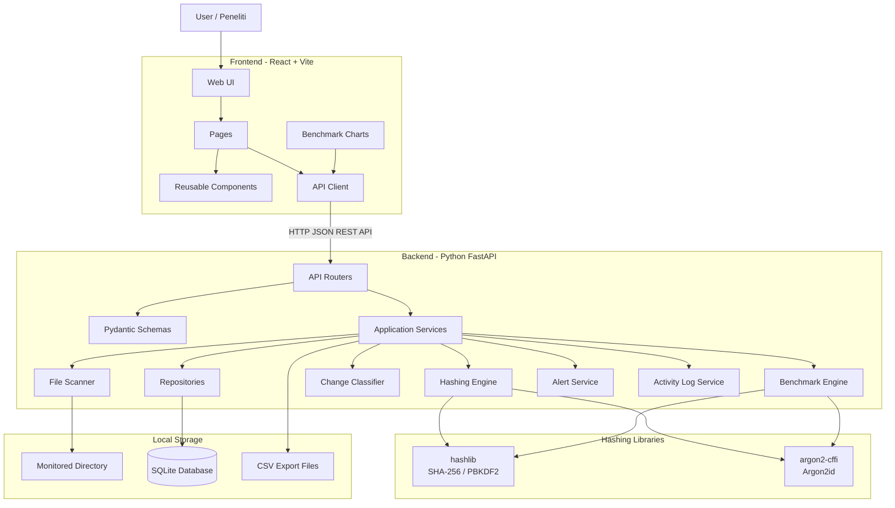
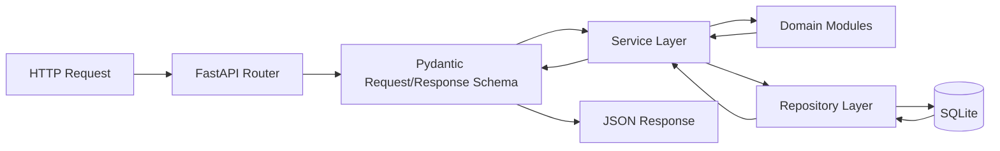
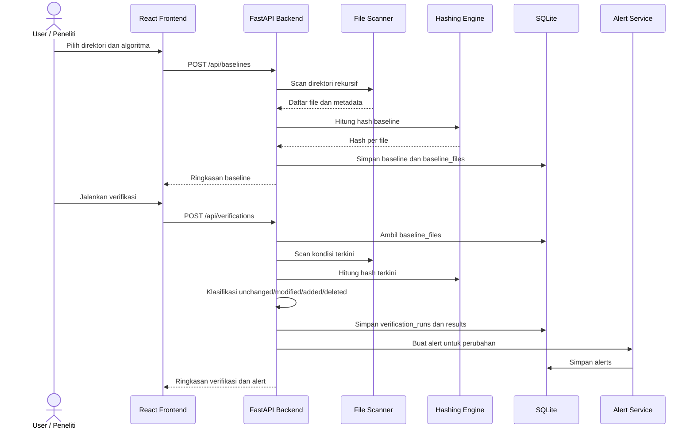
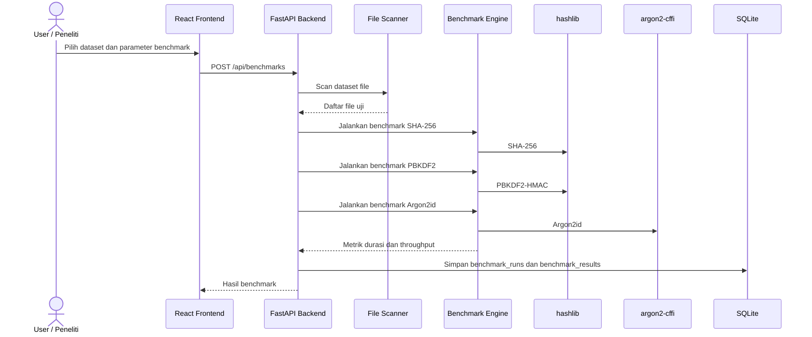

# System Architecture

## Aplikasi Web File Integrity Monitoring (FIM)

Dokumen ini menjelaskan arsitektur sistem berdasarkan SRS aplikasi File Integrity Monitoring (FIM) untuk penelitian skripsi Cyber Security. Arsitektur ini menggunakan stack berikut:

| Komponen | Teknologi |
| --- | --- |
| Backend | Python FastAPI |
| Frontend | React + Vite |
| Database | SQLite |
| Hashing | `hashlib`, `argon2-cffi` |

Dokumen ini hanya menjelaskan desain arsitektur dan tidak berisi implementasi kode.

---

## 1. System Architecture Diagram

### 1.1 High-Level Architecture



### 1.2 Backend Layer Architecture



### 1.3 Core FIM Process Flow



### 1.4 Benchmark Process Flow



---

## 2. Folder Structure Final

Struktur folder final berikut disesuaikan untuk **FastAPI**, **React + Vite**, dan **SQLite**.

```text
project-root/
├── docs/
│   ├── SRS.md
│   └── ARCHITECTURE.md
├── backend/
│   ├── app/
│   │   ├── __init__.py
│   │   ├── main.py
│   │   ├── core/
│   │   │   ├── __init__.py
│   │   │   ├── config.py
│   │   │   ├── constants.py
│   │   │   └── security.py
│   │   ├── db/
│   │   │   ├── __init__.py
│   │   │   ├── database.py
│   │   │   ├── models.py
│   │   │   ├── migrations/
│   │   │   └── fim.sqlite
│   │   ├── schemas/
│   │   │   ├── __init__.py
│   │   │   ├── dashboard_schema.py
│   │   │   ├── monitoring_directory_schema.py
│   │   │   ├── baseline_schema.py
│   │   │   ├── verification_schema.py
│   │   │   ├── alert_schema.py
│   │   │   ├── activity_log_schema.py
│   │   │   └── benchmark_schema.py
│   │   ├── api/
│   │   │   ├── __init__.py
│   │   │   ├── routes.py
│   │   │   └── v1/
│   │   │       ├── __init__.py
│   │   │       ├── dashboard_router.py
│   │   │       ├── monitoring_directory_router.py
│   │   │       ├── baseline_router.py
│   │   │       ├── verification_router.py
│   │   │       ├── alert_router.py
│   │   │       ├── activity_log_router.py
│   │   │       └── benchmark_router.py
│   │   ├── repositories/
│   │   │   ├── __init__.py
│   │   │   ├── monitoring_directory_repository.py
│   │   │   ├── baseline_repository.py
│   │   │   ├── verification_repository.py
│   │   │   ├── alert_repository.py
│   │   │   ├── activity_log_repository.py
│   │   │   └── benchmark_repository.py
│   │   ├── services/
│   │   │   ├── __init__.py
│   │   │   ├── dashboard_service.py
│   │   │   ├── monitoring_directory_service.py
│   │   │   ├── baseline_service.py
│   │   │   ├── verification_service.py
│   │   │   ├── alert_service.py
│   │   │   ├── activity_log_service.py
│   │   │   └── benchmark_service.py
│   │   ├── fim/
│   │   │   ├── __init__.py
│   │   │   ├── file_scanner.py
│   │   │   ├── path_validator.py
│   │   │   ├── baseline_generator.py
│   │   │   ├── integrity_verifier.py
│   │   │   └── change_classifier.py
│   │   ├── hashing/
│   │   │   ├── __init__.py
│   │   │   ├── base_hasher.py
│   │   │   ├── sha256_hasher.py
│   │   │   ├── pbkdf2_hasher.py
│   │   │   ├── argon2id_hasher.py
│   │   │   └── hashing_types.py
│   │   ├── benchmark/
│   │   │   ├── __init__.py
│   │   │   ├── benchmark_runner.py
│   │   │   └── benchmark_calculator.py
│   │   └── utils/
│   │       ├── __init__.py
│   │       ├── response.py
│   │       ├── timer.py
│   │       ├── pagination.py
│   │       └── csv_exporter.py
│   ├── tests/
│   │   ├── unit/
│   │   │   ├── test_file_scanner.py
│   │   │   ├── test_hashing.py
│   │   │   ├── test_change_classifier.py
│   │   │   └── test_benchmark_calculator.py
│   │   └── integration/
│   │       ├── test_baseline_api.py
│   │       ├── test_verification_api.py
│   │       └── test_benchmark_api.py
│   ├── requirements.txt
│   └── .env.example
├── frontend/
│   ├── index.html
│   ├── package.json
│   ├── vite.config.js
│   ├── src/
│   │   ├── main.jsx
│   │   ├── App.jsx
│   │   ├── routes/
│   │   │   └── AppRoutes.jsx
│   │   ├── pages/
│   │   │   ├── DashboardPage.jsx
│   │   │   ├── MonitoringDirectoriesPage.jsx
│   │   │   ├── MonitoringDirectoryDetailPage.jsx
│   │   │   ├── BaselinesPage.jsx
│   │   │   ├── BaselineDetailPage.jsx
│   │   │   ├── VerificationRunsPage.jsx
│   │   │   ├── VerificationDetailPage.jsx
│   │   │   ├── AlertsPage.jsx
│   │   │   ├── AlertDetailPage.jsx
│   │   │   ├── ActivityLogsPage.jsx
│   │   │   ├── BenchmarksPage.jsx
│   │   │   ├── BenchmarkDetailPage.jsx
│   │   │   └── NotFoundPage.jsx
│   │   ├── components/
│   │   │   ├── layout/
│   │   │   │   ├── AppLayout.jsx
│   │   │   │   ├── Sidebar.jsx
│   │   │   │   └── Header.jsx
│   │   │   ├── dashboard/
│   │   │   ├── monitoring-directories/
│   │   │   ├── baselines/
│   │   │   ├── verifications/
│   │   │   ├── alerts/
│   │   │   ├── activity-logs/
│   │   │   ├── benchmarks/
│   │   │   ├── tables/
│   │   │   ├── charts/
│   │   │   └── common/
│   │   ├── services/
│   │   │   ├── apiClient.js
│   │   │   ├── dashboardApi.js
│   │   │   ├── monitoringDirectoryApi.js
│   │   │   ├── baselineApi.js
│   │   │   ├── verificationApi.js
│   │   │   ├── alertApi.js
│   │   │   ├── activityLogApi.js
│   │   │   └── benchmarkApi.js
│   │   ├── hooks/
│   │   ├── utils/
│   │   └── styles/
│   └── tests/
├── storage/
│   ├── exports/
│   └── temp/
├── README.md
└── .gitignore
```

### 2.1 Penjelasan Struktur Backend

| Folder/File | Fungsi |
| --- | --- |
| `backend/app/main.py` | Entry point FastAPI. |
| `backend/app/core/` | Konfigurasi aplikasi, konstanta, dan utilitas keamanan sederhana. |
| `backend/app/db/` | Koneksi SQLite, model database, dan migrasi. |
| `backend/app/schemas/` | Pydantic schema untuk validasi request dan response API. |
| `backend/app/api/v1/` | Router endpoint REST API versi 1. |
| `backend/app/repositories/` | Akses data ke SQLite. |
| `backend/app/services/` | Orkestrasi business logic. |
| `backend/app/fim/` | Modul inti FIM: scanner, validator path, baseline, verifikasi, klasifikasi perubahan. |
| `backend/app/hashing/` | Modul hashing SHA-256, PBKDF2, dan Argon2id. |
| `backend/app/benchmark/` | Modul benchmark algoritma. |
| `backend/app/utils/` | Helper response, timer, pagination, dan ekspor CSV. |

### 2.2 Penjelasan Struktur Frontend

| Folder/File | Fungsi |
| --- | --- |
| `frontend/src/main.jsx` | Entry point React. |
| `frontend/src/App.jsx` | Root component aplikasi. |
| `frontend/src/routes/` | Konfigurasi routing halaman. |
| `frontend/src/pages/` | Halaman utama aplikasi. |
| `frontend/src/components/` | Komponen reusable untuk layout, tabel, grafik, form, dan alert. |
| `frontend/src/services/` | API client untuk komunikasi dengan FastAPI. |
| `frontend/src/hooks/` | Custom hooks untuk data fetching dan state UI. |
| `frontend/src/utils/` | Formatter, helper status, dan utilitas frontend lain. |
| `frontend/src/styles/` | Style global aplikasi. |

---

## 3. Daftar Seluruh Endpoint API

Base URL yang direkomendasikan:

```text
/api/v1
```

### 3.1 Dashboard API

| Method | Endpoint | Fungsi |
| --- | --- | --- |
| GET | `/api/v1/dashboard/summary` | Mengambil ringkasan dashboard. |
| GET | `/api/v1/dashboard/recent-alerts` | Mengambil alert terbaru untuk dashboard. |
| GET | `/api/v1/dashboard/recent-activities` | Mengambil aktivitas terbaru untuk dashboard. |

### 3.2 Monitoring Directory API

| Method | Endpoint | Fungsi |
| --- | --- | --- |
| GET | `/api/v1/monitoring-directories` | Mengambil daftar direktori monitoring. |
| POST | `/api/v1/monitoring-directories` | Menambahkan direktori monitoring baru. |
| GET | `/api/v1/monitoring-directories/{directory_id}` | Mengambil detail direktori monitoring. |
| PUT | `/api/v1/monitoring-directories/{directory_id}` | Mengubah konfigurasi direktori monitoring. |
| PATCH | `/api/v1/monitoring-directories/{directory_id}/activate` | Mengaktifkan direktori monitoring. |
| PATCH | `/api/v1/monitoring-directories/{directory_id}/deactivate` | Menonaktifkan direktori monitoring. |
| DELETE | `/api/v1/monitoring-directories/{directory_id}` | Menghapus direktori monitoring. |
| POST | `/api/v1/monitoring-directories/validate-path` | Memvalidasi path direktori. |

### 3.3 Baseline API

| Method | Endpoint | Fungsi |
| --- | --- | --- |
| GET | `/api/v1/baselines` | Mengambil daftar baseline. |
| POST | `/api/v1/baselines` | Membuat baseline baru. |
| GET | `/api/v1/baselines/{baseline_id}` | Mengambil detail baseline. |
| GET | `/api/v1/baselines/{baseline_id}/files` | Mengambil daftar file pada baseline. |
| GET | `/api/v1/baselines/{baseline_id}/summary` | Mengambil ringkasan baseline. |
| DELETE | `/api/v1/baselines/{baseline_id}` | Menghapus baseline. |

### 3.4 Verification API

| Method | Endpoint | Fungsi |
| --- | --- | --- |
| GET | `/api/v1/verifications` | Mengambil daftar verification run. |
| POST | `/api/v1/verifications` | Menjalankan verifikasi terhadap baseline. |
| GET | `/api/v1/verifications/{verification_id}` | Mengambil detail verification run. |
| GET | `/api/v1/verifications/{verification_id}/results` | Mengambil detail hasil verifikasi per file. |
| GET | `/api/v1/verifications/{verification_id}/summary` | Mengambil ringkasan hasil verifikasi. |
| GET | `/api/v1/verifications/{verification_id}/export` | Mengekspor hasil verifikasi ke CSV. |
| DELETE | `/api/v1/verifications/{verification_id}` | Menghapus verification run. |

### 3.5 Alert API

| Method | Endpoint | Fungsi |
| --- | --- | --- |
| GET | `/api/v1/alerts` | Mengambil daftar alert. |
| GET | `/api/v1/alerts/{alert_id}` | Mengambil detail alert. |
| PATCH | `/api/v1/alerts/{alert_id}/acknowledge` | Mengubah status alert menjadi acknowledged. |
| PATCH | `/api/v1/alerts/{alert_id}/resolve` | Mengubah status alert menjadi resolved. |
| PATCH | `/api/v1/alerts/{alert_id}/reopen` | Membuka kembali alert yang sudah resolved. |
| DELETE | `/api/v1/alerts/{alert_id}` | Menghapus alert. |

### 3.6 Activity Log API

| Method | Endpoint | Fungsi |
| --- | --- | --- |
| GET | `/api/v1/activity-logs` | Mengambil daftar log aktivitas. |
| GET | `/api/v1/activity-logs/{log_id}` | Mengambil detail log aktivitas. |
| DELETE | `/api/v1/activity-logs/{log_id}` | Menghapus satu log aktivitas. |
| DELETE | `/api/v1/activity-logs` | Menghapus log aktivitas berdasarkan filter atau seluruh log. |

### 3.7 Benchmark API

| Method | Endpoint | Fungsi |
| --- | --- | --- |
| GET | `/api/v1/benchmarks` | Mengambil daftar benchmark run. |
| POST | `/api/v1/benchmarks` | Menjalankan benchmark baru. |
| GET | `/api/v1/benchmarks/{benchmark_id}` | Mengambil detail benchmark run. |
| GET | `/api/v1/benchmarks/{benchmark_id}/results` | Mengambil hasil benchmark per algoritma. |
| GET | `/api/v1/benchmarks/{benchmark_id}/summary` | Mengambil ringkasan benchmark. |
| GET | `/api/v1/benchmarks/{benchmark_id}/export` | Mengekspor hasil benchmark ke CSV. |
| DELETE | `/api/v1/benchmarks/{benchmark_id}` | Menghapus benchmark run. |

### 3.8 Health Check API

| Method | Endpoint | Fungsi |
| --- | --- | --- |
| GET | `/api/v1/health` | Memeriksa status aplikasi backend. |
| GET | `/api/v1/health/database` | Memeriksa koneksi SQLite. |

---

## 4. Daftar Seluruh Halaman Frontend

### 4.1 Routing Frontend

| Route | Halaman | Fungsi |
| --- | --- | --- |
| `/` | `DashboardPage` | Menampilkan ringkasan monitoring, baseline terakhir, verifikasi terakhir, alert terbuka, dan benchmark terakhir. |
| `/monitoring-directories` | `MonitoringDirectoriesPage` | Menampilkan daftar direktori monitoring dan form tambah direktori. |
| `/monitoring-directories/:id` | `MonitoringDirectoryDetailPage` | Menampilkan detail direktori monitoring, status aktif, baseline terkait, dan aksi validasi path. |
| `/baselines` | `BaselinesPage` | Menampilkan daftar baseline dan form generate baseline. |
| `/baselines/:id` | `BaselineDetailPage` | Menampilkan detail baseline dan daftar file baseline. |
| `/verifications` | `VerificationRunsPage` | Menampilkan daftar verification run dan aksi menjalankan verifikasi. |
| `/verifications/:id` | `VerificationDetailPage` | Menampilkan ringkasan dan detail hasil verifikasi per file. |
| `/alerts` | `AlertsPage` | Menampilkan daftar alert dengan filter status, severity, dan jenis perubahan. |
| `/alerts/:id` | `AlertDetailPage` | Menampilkan detail alert dan aksi acknowledge, resolve, atau reopen. |
| `/activity-logs` | `ActivityLogsPage` | Menampilkan log aktivitas sistem. |
| `/benchmarks` | `BenchmarksPage` | Menampilkan daftar benchmark dan form menjalankan benchmark baru. |
| `/benchmarks/:id` | `BenchmarkDetailPage` | Menampilkan hasil benchmark dalam tabel dan grafik. |
| `*` | `NotFoundPage` | Menampilkan halaman jika route tidak ditemukan. |

### 4.2 Komponen UI Utama

| Komponen | Fungsi |
| --- | --- |
| `AppLayout` | Layout utama berisi sidebar, header, dan area konten. |
| `Sidebar` | Navigasi utama aplikasi. |
| `Header` | Judul halaman dan status aplikasi. |
| `SummaryCard` | Kartu ringkasan dashboard. |
| `DirectoryForm` | Form tambah atau ubah direktori monitoring. |
| `BaselineForm` | Form generate baseline dan pilih algoritma. |
| `VerificationRunButton` | Tombol menjalankan verifikasi dari baseline. |
| `VerificationResultTable` | Tabel hasil verifikasi per file. |
| `AlertTable` | Tabel daftar alert. |
| `ActivityLogTable` | Tabel log aktivitas. |
| `BenchmarkForm` | Form parameter benchmark SHA-256, PBKDF2, dan Argon2id. |
| `BenchmarkResultTable` | Tabel hasil benchmark. |
| `BenchmarkChart` | Grafik perbandingan durasi dan throughput algoritma. |
| `StatusBadge` | Badge status seperti completed, failed, open, resolved. |
| `Pagination` | Navigasi halaman data tabel. |

---

## 5. Daftar Seluruh Tabel Database

Database menggunakan SQLite. Penamaan tabel mengikuti snake_case agar konsisten dengan ekosistem Python.

### 5.1 Ringkasan Tabel

| No | Tabel | Fungsi |
| --- | --- | --- |
| 1 | `monitoring_directories` | Menyimpan konfigurasi direktori yang dipantau. |
| 2 | `baselines` | Menyimpan metadata proses baseline. |
| 3 | `baseline_files` | Menyimpan hash dan metadata file pada baseline. |
| 4 | `verification_runs` | Menyimpan metadata proses verifikasi. |
| 5 | `verification_file_results` | Menyimpan hasil perbandingan file per verifikasi. |
| 6 | `alerts` | Menyimpan alert perubahan file. |
| 7 | `activity_logs` | Menyimpan log aktivitas sistem. |
| 8 | `benchmark_runs` | Menyimpan metadata proses benchmark. |
| 9 | `benchmark_results` | Menyimpan hasil benchmark per algoritma. |

### 5.2 `monitoring_directories`

| Kolom | Tipe SQLite | Keterangan |
| --- | --- | --- |
| `id` | INTEGER PRIMARY KEY AUTOINCREMENT | ID direktori monitoring. |
| `name` | TEXT NOT NULL | Nama konfigurasi direktori. |
| `path` | TEXT NOT NULL | Path absolut direktori. |
| `is_active` | INTEGER NOT NULL DEFAULT 1 | Status aktif, 1 untuk aktif dan 0 untuk nonaktif. |
| `created_at` | TEXT NOT NULL | Timestamp pembuatan. |
| `updated_at` | TEXT NOT NULL | Timestamp perubahan. |

### 5.3 `baselines`

| Kolom | Tipe SQLite | Keterangan |
| --- | --- | --- |
| `id` | INTEGER PRIMARY KEY AUTOINCREMENT | ID baseline. |
| `monitoring_directory_id` | INTEGER NOT NULL | Foreign key ke `monitoring_directories.id`. |
| `algorithm` | TEXT NOT NULL | SHA-256, PBKDF2, atau Argon2id. |
| `algorithm_params` | TEXT | JSON string parameter algoritma. |
| `total_files` | INTEGER NOT NULL DEFAULT 0 | Jumlah file baseline. |
| `total_size_bytes` | INTEGER NOT NULL DEFAULT 0 | Total ukuran file. |
| `started_at` | TEXT NOT NULL | Waktu mulai baseline. |
| `finished_at` | TEXT | Waktu selesai baseline. |
| `duration_ms` | INTEGER | Durasi proses dalam milidetik. |
| `status` | TEXT NOT NULL | PENDING, RUNNING, COMPLETED, atau FAILED. |
| `error_message` | TEXT | Pesan error jika gagal. |
| `created_at` | TEXT NOT NULL | Timestamp pembuatan record. |

### 5.4 `baseline_files`

| Kolom | Tipe SQLite | Keterangan |
| --- | --- | --- |
| `id` | INTEGER PRIMARY KEY AUTOINCREMENT | ID file baseline. |
| `baseline_id` | INTEGER NOT NULL | Foreign key ke `baselines.id`. |
| `relative_path` | TEXT NOT NULL | Path relatif file dari direktori monitoring. |
| `file_size_bytes` | INTEGER NOT NULL | Ukuran file. |
| `last_modified_at` | TEXT | Timestamp modifikasi terakhir file. |
| `hash_value` | TEXT NOT NULL | Nilai hash file. |
| `hash_duration_ms` | INTEGER | Durasi hashing per file. |
| `read_error` | TEXT | Error baca file jika ada. |
| `created_at` | TEXT NOT NULL | Timestamp pembuatan record. |

Index yang direkomendasikan:

- `idx_baseline_files_baseline_id`
- `idx_baseline_files_relative_path`
- `uq_baseline_files_baseline_path` pada kombinasi `baseline_id` dan `relative_path`

### 5.5 `verification_runs`

| Kolom | Tipe SQLite | Keterangan |
| --- | --- | --- |
| `id` | INTEGER PRIMARY KEY AUTOINCREMENT | ID verification run. |
| `baseline_id` | INTEGER NOT NULL | Foreign key ke `baselines.id`. |
| `started_at` | TEXT NOT NULL | Waktu mulai verifikasi. |
| `finished_at` | TEXT | Waktu selesai verifikasi. |
| `duration_ms` | INTEGER | Durasi proses dalam milidetik. |
| `total_scanned_files` | INTEGER NOT NULL DEFAULT 0 | Jumlah file terkini yang dipindai. |
| `unchanged_count` | INTEGER NOT NULL DEFAULT 0 | Jumlah file unchanged. |
| `modified_count` | INTEGER NOT NULL DEFAULT 0 | Jumlah file modified. |
| `added_count` | INTEGER NOT NULL DEFAULT 0 | Jumlah file added. |
| `deleted_count` | INTEGER NOT NULL DEFAULT 0 | Jumlah file deleted. |
| `status` | TEXT NOT NULL | PENDING, RUNNING, COMPLETED, atau FAILED. |
| `error_message` | TEXT | Pesan error jika gagal. |
| `created_at` | TEXT NOT NULL | Timestamp pembuatan record. |

### 5.6 `verification_file_results`

| Kolom | Tipe SQLite | Keterangan |
| --- | --- | --- |
| `id` | INTEGER PRIMARY KEY AUTOINCREMENT | ID hasil file. |
| `verification_run_id` | INTEGER NOT NULL | Foreign key ke `verification_runs.id`. |
| `relative_path` | TEXT NOT NULL | Path relatif file. |
| `status` | TEXT NOT NULL | UNCHANGED, MODIFIED, ADDED, DELETED, atau ERROR. |
| `baseline_hash` | TEXT | Hash dari baseline. |
| `current_hash` | TEXT | Hash saat verifikasi. |
| `baseline_size_bytes` | INTEGER | Ukuran file baseline. |
| `current_size_bytes` | INTEGER | Ukuran file terkini. |
| `baseline_modified_at` | TEXT | Modified time baseline. |
| `current_modified_at` | TEXT | Modified time terkini. |
| `hash_duration_ms` | INTEGER | Durasi hashing file saat verifikasi. |
| `error_message` | TEXT | Error jika ada. |
| `created_at` | TEXT NOT NULL | Timestamp pembuatan record. |

Index yang direkomendasikan:

- `idx_verification_file_results_run_id`
- `idx_verification_file_results_status`
- `idx_verification_file_results_relative_path`

### 5.7 `alerts`

| Kolom | Tipe SQLite | Keterangan |
| --- | --- | --- |
| `id` | INTEGER PRIMARY KEY AUTOINCREMENT | ID alert. |
| `verification_run_id` | INTEGER NOT NULL | Foreign key ke `verification_runs.id`. |
| `verification_file_result_id` | INTEGER NOT NULL | Foreign key ke `verification_file_results.id`. |
| `alert_type` | TEXT NOT NULL | FILE_MODIFIED, FILE_ADDED, atau FILE_DELETED. |
| `severity` | TEXT NOT NULL | LOW, MEDIUM, HIGH, atau CRITICAL. |
| `title` | TEXT NOT NULL | Judul alert. |
| `message` | TEXT NOT NULL | Detail alert. |
| `status` | TEXT NOT NULL | OPEN, ACKNOWLEDGED, atau RESOLVED. |
| `created_at` | TEXT NOT NULL | Timestamp alert dibuat. |
| `acknowledged_at` | TEXT | Timestamp acknowledge. |
| `resolved_at` | TEXT | Timestamp resolve. |

### 5.8 `activity_logs`

| Kolom | Tipe SQLite | Keterangan |
| --- | --- | --- |
| `id` | INTEGER PRIMARY KEY AUTOINCREMENT | ID log aktivitas. |
| `activity_type` | TEXT NOT NULL | DIRECTORY, BASELINE, VERIFICATION, ALERT, atau BENCHMARK. |
| `action` | TEXT NOT NULL | CREATE, UPDATE, RUN, COMPLETE, FAIL, ACKNOWLEDGE, RESOLVE, atau DELETE. |
| `status` | TEXT NOT NULL | INFO, SUCCESS, WARNING, atau ERROR. |
| `description` | TEXT NOT NULL | Deskripsi aktivitas. |
| `reference_type` | TEXT | Jenis entitas terkait. |
| `reference_id` | INTEGER | ID entitas terkait. |
| `metadata` | TEXT | JSON string data tambahan. |
| `created_at` | TEXT NOT NULL | Timestamp log dibuat. |

### 5.9 `benchmark_runs`

| Kolom | Tipe SQLite | Keterangan |
| --- | --- | --- |
| `id` | INTEGER PRIMARY KEY AUTOINCREMENT | ID benchmark run. |
| `monitoring_directory_id` | INTEGER | Foreign key opsional ke `monitoring_directories.id`. |
| `dataset_path` | TEXT | Path dataset uji jika tidak memakai konfigurasi direktori. |
| `total_files` | INTEGER NOT NULL DEFAULT 0 | Jumlah file benchmark. |
| `total_size_bytes` | INTEGER NOT NULL DEFAULT 0 | Total ukuran dataset. |
| `started_at` | TEXT NOT NULL | Waktu mulai benchmark. |
| `finished_at` | TEXT | Waktu selesai benchmark. |
| `duration_ms` | INTEGER | Total durasi benchmark. |
| `status` | TEXT NOT NULL | PENDING, RUNNING, COMPLETED, atau FAILED. |
| `error_message` | TEXT | Pesan error jika gagal. |
| `created_at` | TEXT NOT NULL | Timestamp pembuatan record. |

### 5.10 `benchmark_results`

| Kolom | Tipe SQLite | Keterangan |
| --- | --- | --- |
| `id` | INTEGER PRIMARY KEY AUTOINCREMENT | ID hasil benchmark. |
| `benchmark_run_id` | INTEGER NOT NULL | Foreign key ke `benchmark_runs.id`. |
| `algorithm` | TEXT NOT NULL | SHA-256, PBKDF2, atau Argon2id. |
| `algorithm_params` | TEXT | JSON string parameter algoritma. |
| `file_count` | INTEGER NOT NULL | Jumlah file diproses algoritma ini. |
| `total_size_bytes` | INTEGER NOT NULL | Total ukuran file. |
| `total_duration_ms` | INTEGER NOT NULL | Total durasi algoritma. |
| `average_duration_ms` | REAL | Rata-rata durasi per file. |
| `throughput_mb_per_sec` | REAL | Throughput dalam MB/s. |
| `min_duration_ms` | REAL | Durasi minimum per file. |
| `max_duration_ms` | REAL | Durasi maksimum per file. |
| `created_at` | TEXT NOT NULL | Timestamp pembuatan record. |

---

## 6. Mapping Teknologi ke Modul

| Kebutuhan | Modul | Teknologi Utama |
| --- | --- | --- |
| Web API | FastAPI routers dan services | Python FastAPI |
| Validasi request/response | Schemas | Pydantic |
| UI aplikasi | Pages dan components | React + Vite |
| Komunikasi frontend-backend | API client | Fetch API atau Axios |
| Penyimpanan lokal | Repositories dan models | SQLite |
| Hash SHA-256 | `sha256_hasher.py` | `hashlib.sha256` |
| Hash PBKDF2 | `pbkdf2_hasher.py` | `hashlib.pbkdf2_hmac` |
| Hash Argon2id | `argon2id_hasher.py` | `argon2-cffi` |
| Benchmark | `benchmark_runner.py` | Timer Python dan hashing libraries |
| Ekspor laporan | `csv_exporter.py` | Python CSV utilities |

---

## 7. Catatan Arsitektural

1. **FastAPI** bertindak sebagai backend tunggal untuk API, business logic, hashing, benchmark, dan akses database.
2. **React + Vite** hanya bertanggung jawab pada antarmuka pengguna, visualisasi data, dan pemanggilan API.
3. **SQLite** dipilih karena ringan dan sesuai untuk kebutuhan penelitian lokal atau skripsi.
4. **SHA-256** dan **PBKDF2** diimplementasikan menggunakan `hashlib`.
5. **Argon2id** diimplementasikan menggunakan `argon2-cffi`.
6. Sistem sebaiknya tidak menyimpan isi file ke database; database hanya menyimpan path, metadata, hash, hasil verifikasi, alert, log, dan hasil benchmark.
7. Untuk dataset besar, proses baseline, verifikasi, dan benchmark dapat dikembangkan menjadi background job, tetapi versi penelitian dapat menjalankannya secara sinkron terlebih dahulu selama status proses tetap dicatat.
