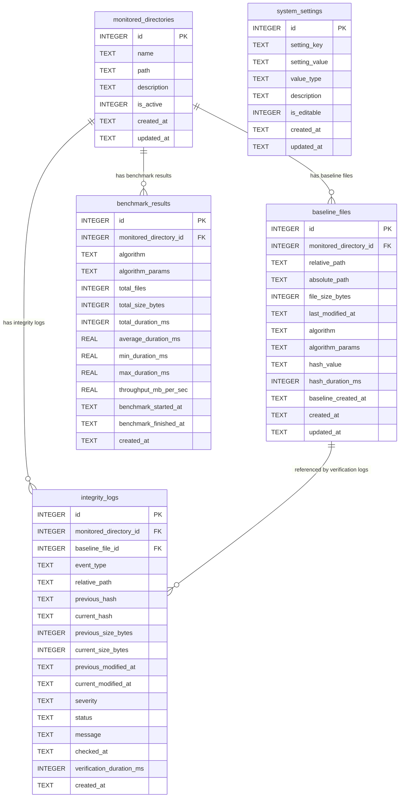

# Final Database Design

## Aplikasi File Integrity Monitoring (FIM) Berbasis SQLite

Dokumen ini mendefinisikan desain database final untuk aplikasi web File Integrity Monitoring (FIM) berbasis penelitian skripsi Cyber Security. Database yang digunakan adalah **SQLite**.

Dokumen ini hanya berisi desain database dan tidak berisi implementasi kode backend.

---

## 1. Prinsip Desain Database

### 1.1 Tujuan Database

Database digunakan untuk menyimpan:

1. Direktori yang dipantau.
2. Baseline hash file.
3. Log hasil pemeriksaan integritas file.
4. Hasil benchmark algoritma SHA-256, PBKDF2, dan Argon2id.
5. Konfigurasi sistem.

### 1.2 Tabel Utama

Desain final difokuskan pada lima tabel utama berikut:

| No | Nama Tabel | Fungsi Utama |
| --- | --- | --- |
| 1 | `monitored_directories` | Menyimpan daftar direktori yang dipantau oleh sistem. |
| 2 | `baseline_files` | Menyimpan baseline hash dan metadata file pada direktori monitoring. |
| 3 | `integrity_logs` | Menyimpan hasil verifikasi integritas dan deteksi perubahan file. |
| 4 | `benchmark_results` | Menyimpan hasil benchmark algoritma hashing/KDF. |
| 5 | `system_settings` | Menyimpan konfigurasi global aplikasi. |

### 1.3 Konvensi Data SQLite

| Kebutuhan Data | Tipe SQLite yang Digunakan | Catatan |
| --- | --- | --- |
| Primary key | `INTEGER PRIMARY KEY AUTOINCREMENT` | Digunakan untuk ID internal. |
| String pendek/panjang | `TEXT` | SQLite tidak membedakan `VARCHAR` dan `TEXT` secara ketat. |
| Boolean | `INTEGER` | `1` berarti true, `0` berarti false. |
| Timestamp | `TEXT` | Disimpan dalam format ISO 8601, contoh `2026-06-02T10:30:00Z`. |
| Durasi | `INTEGER` atau `REAL` | Milidetik memakai `INTEGER`; rata-rata dapat memakai `REAL`. |
| Ukuran file | `INTEGER` | Byte. |
| JSON | `TEXT` | JSON disimpan sebagai string. |

---

## 2. ERD

### 2.1 Entity Relationship Diagram

### 2.2 Penjelasan Relasi ERD

| Relasi | Kardinalitas | Penjelasan |
| --- | --- | --- |
| `monitored_directories` → `baseline_files` | One-to-Many | Satu direktori monitoring dapat memiliki banyak file baseline. |
| `monitored_directories` → `integrity_logs` | One-to-Many | Satu direktori monitoring dapat menghasilkan banyak log integritas. |
| `monitored_directories` → `benchmark_results` | One-to-Many | Satu direktori monitoring dapat memiliki banyak hasil benchmark. |
| `baseline_files` → `integrity_logs` | One-to-Many | Satu file baseline dapat direferensikan oleh banyak log pemeriksaan integritas. |
| `system_settings` | Standalone | Tabel konfigurasi global, tidak bergantung pada tabel lain. |

---

## 3. Tabel `monitored_directories`

### 3.1 Fungsi

Tabel `monitored_directories` menyimpan direktori yang akan dipantau oleh aplikasi FIM. Setiap record mewakili satu konfigurasi direktori monitoring.

### 3.2 Struktur Kolom

| Kolom | Tipe Data SQLite | Constraint | Keterangan |
| --- | --- | --- | --- |
| `id` | `INTEGER` | `PRIMARY KEY AUTOINCREMENT` | ID unik direktori monitoring. |
| `name` | `TEXT` | `NOT NULL` | Nama direktori monitoring yang mudah dibaca pengguna. |
| `path` | `TEXT` | `NOT NULL UNIQUE` | Path absolut direktori yang dipantau. |
| `description` | `TEXT` | `NULL` | Deskripsi opsional untuk kebutuhan penelitian. |
| `is_active` | `INTEGER` | `NOT NULL DEFAULT 1` | Status aktif direktori; `1` aktif, `0` nonaktif. |
| `created_at` | `TEXT` | `NOT NULL` | Timestamp saat record dibuat. |
| `updated_at` | `TEXT` | `NOT NULL` | Timestamp saat record terakhir diperbarui. |

### 3.3 Index yang Direkomendasikan

| Nama Index | Kolom | Tujuan |
| --- | --- | --- |
| `idx_monitored_directories_is_active` | `is_active` | Mempercepat filter direktori aktif. |
| `idx_monitored_directories_path` | `path` | Mempercepat pencarian berdasarkan path. |

### 3.4 Contoh Data

| id | name | path | is_active |
| --- | --- | --- | --- |
| 1 | Dataset Skripsi | `/home/user/fim-dataset` | 1 |
| 2 | Folder Pengujian | `/home/user/test-files` | 1 |

---

## 4. Tabel `baseline_files`

### 4.1 Fungsi

Tabel `baseline_files` menyimpan nilai baseline hash setiap file dalam direktori monitoring. Data ini menjadi acuan saat sistem melakukan verifikasi integritas.

### 4.2 Struktur Kolom

| Kolom | Tipe Data SQLite | Constraint | Keterangan |
| --- | --- | --- | --- |
| `id` | `INTEGER` | `PRIMARY KEY AUTOINCREMENT` | ID unik file baseline. |
| `monitored_directory_id` | `INTEGER` | `NOT NULL` | Foreign key ke `monitored_directories.id`. |
| `relative_path` | `TEXT` | `NOT NULL` | Path relatif file terhadap direktori monitoring. |
| `absolute_path` | `TEXT` | `NOT NULL` | Path absolut file saat baseline dibuat. |
| `file_size_bytes` | `INTEGER` | `NOT NULL` | Ukuran file dalam byte saat baseline dibuat. |
| `last_modified_at` | `TEXT` | `NULL` | Timestamp modifikasi terakhir file saat baseline dibuat. |
| `algorithm` | `TEXT` | `NOT NULL` | Algoritma hash/KDF, contoh `SHA-256`, `PBKDF2`, atau `Argon2id`. |
| `algorithm_params` | `TEXT` | `NULL` | Parameter algoritma dalam format JSON string. |
| `hash_value` | `TEXT` | `NOT NULL` | Nilai hash baseline. |
| `hash_duration_ms` | `INTEGER` | `NULL` | Durasi hashing file dalam milidetik. |
| `baseline_created_at` | `TEXT` | `NOT NULL` | Timestamp pembuatan baseline untuk file tersebut. |
| `created_at` | `TEXT` | `NOT NULL` | Timestamp record dibuat. |
| `updated_at` | `TEXT` | `NOT NULL` | Timestamp record terakhir diperbarui. |

### 4.3 Relasi

| Kolom | Referensi | On Delete | Penjelasan |
| --- | --- | --- | --- |
| `monitored_directory_id` | `monitored_directories.id` | `CASCADE` | Jika direktori monitoring dihapus, baseline file terkait ikut dihapus. |

### 4.4 Index dan Unique Constraint yang Direkomendasikan

| Nama Index / Constraint | Kolom | Tujuan |
| --- | --- | --- |
| `idx_baseline_files_directory_id` | `monitored_directory_id` | Mempercepat pencarian baseline berdasarkan direktori. |
| `idx_baseline_files_relative_path` | `relative_path` | Mempercepat pencarian file berdasarkan path relatif. |
| `idx_baseline_files_algorithm` | `algorithm` | Mempermudah analisis baseline per algoritma. |
| `uq_baseline_files_directory_path_algorithm` | `monitored_directory_id`, `relative_path`, `algorithm` | Mencegah baseline duplikat untuk file dan algoritma yang sama dalam satu direktori. |

### 4.5 Catatan Desain

- `relative_path` digunakan untuk membandingkan struktur file secara stabil walaupun base directory berbeda antar perangkat penelitian.
- `absolute_path` disimpan untuk membantu debugging dan audit lokal.
- `algorithm_params` disimpan karena PBKDF2 dan Argon2id membutuhkan parameter agar verifikasi dapat direproduksi.
- Jika penelitian membutuhkan riwayat banyak baseline untuk file yang sama, unique constraint dapat diperluas dengan menambahkan konsep `baseline_batch_id`. Namun untuk versi final sederhana, tabel ini menyimpan baseline aktif/terakhir per file dan algoritma.

---

## 5. Tabel `integrity_logs`

### 5.1 Fungsi

Tabel `integrity_logs` menyimpan hasil verifikasi integritas file. Tabel ini mencatat kejadian seperti file tidak berubah, dimodifikasi, ditambahkan, dihapus, atau gagal dibaca.

### 5.2 Struktur Kolom

| Kolom | Tipe Data SQLite | Constraint | Keterangan |
| --- | --- | --- | --- |
| `id` | `INTEGER` | `PRIMARY KEY AUTOINCREMENT` | ID unik log integritas. |
| `monitored_directory_id` | `INTEGER` | `NOT NULL` | Foreign key ke `monitored_directories.id`. |
| `baseline_file_id` | `INTEGER` | `NULL` | Foreign key opsional ke `baseline_files.id`. Bernilai `NULL` untuk file baru atau error tanpa baseline. |
| `event_type` | `TEXT` | `NOT NULL` | Jenis event: `UNCHANGED`, `MODIFIED`, `ADDED`, `DELETED`, atau `ERROR`. |
| `relative_path` | `TEXT` | `NOT NULL` | Path relatif file yang diperiksa. |
| `previous_hash` | `TEXT` | `NULL` | Hash baseline sebelum pemeriksaan. |
| `current_hash` | `TEXT` | `NULL` | Hash terkini saat verifikasi. |
| `previous_size_bytes` | `INTEGER` | `NULL` | Ukuran file pada baseline. |
| `current_size_bytes` | `INTEGER` | `NULL` | Ukuran file saat verifikasi. |
| `previous_modified_at` | `TEXT` | `NULL` | Timestamp modifikasi file pada baseline. |
| `current_modified_at` | `TEXT` | `NULL` | Timestamp modifikasi file saat verifikasi. |
| `severity` | `TEXT` | `NOT NULL DEFAULT 'INFO'` | Severity log: `INFO`, `LOW`, `MEDIUM`, `HIGH`, atau `CRITICAL`. |
| `status` | `TEXT` | `NOT NULL DEFAULT 'OPEN'` | Status tindak lanjut: `OPEN`, `ACKNOWLEDGED`, atau `RESOLVED`. |
| `message` | `TEXT` | `NULL` | Pesan deskriptif hasil pemeriksaan. |
| `checked_at` | `TEXT` | `NOT NULL` | Timestamp saat file diperiksa. |
| `verification_duration_ms` | `INTEGER` | `NULL` | Durasi verifikasi file dalam milidetik. |
| `created_at` | `TEXT` | `NOT NULL` | Timestamp record dibuat. |

### 5.3 Relasi

| Kolom | Referensi | On Delete | Penjelasan |
| --- | --- | --- | --- |
| `monitored_directory_id` | `monitored_directories.id` | `CASCADE` | Log integritas terikat pada direktori monitoring. |
| `baseline_file_id` | `baseline_files.id` | `SET NULL` | Jika baseline file dihapus, riwayat log tetap disimpan. |

### 5.4 Index yang Direkomendasikan

| Nama Index | Kolom | Tujuan |
| --- | --- | --- |
| `idx_integrity_logs_directory_id` | `monitored_directory_id` | Mempercepat pencarian log per direktori. |
| `idx_integrity_logs_baseline_file_id` | `baseline_file_id` | Mempercepat pencarian log berdasarkan file baseline. |
| `idx_integrity_logs_event_type` | `event_type` | Mempercepat filter modified, added, deleted, dan error. |
| `idx_integrity_logs_status` | `status` | Mempercepat filter alert/log yang masih open. |
| `idx_integrity_logs_checked_at` | `checked_at` | Mempercepat filter berdasarkan waktu pemeriksaan. |

### 5.5 Mapping Event Type ke Kondisi File

| `event_type` | Kondisi | Nilai Baseline | Nilai Terkini |
| --- | --- | --- | --- |
| `UNCHANGED` | File ada dan hash sama. | Ada | Ada |
| `MODIFIED` | File ada tetapi hash berbeda. | Ada | Ada |
| `ADDED` | File baru tidak ada pada baseline. | Tidak ada | Ada |
| `DELETED` | File pada baseline tidak ditemukan saat verifikasi. | Ada | Tidak ada |
| `ERROR` | File gagal dibaca atau gagal diproses. | Opsional | Opsional |

### 5.6 Mapping Severity Default

| `event_type` | Default `severity` | Alasan |
| --- | --- | --- |
| `UNCHANGED` | `INFO` | Tidak ada perubahan. |
| `ADDED` | `MEDIUM` | File baru perlu ditinjau. |
| `MODIFIED` | `HIGH` | Isi file berubah dari baseline. |
| `DELETED` | `HIGH` | File baseline hilang dari direktori. |
| `ERROR` | `MEDIUM` | Pemeriksaan tidak berhasil dilakukan. |

---

## 6. Tabel `benchmark_results`

### 6.1 Fungsi

Tabel `benchmark_results` menyimpan hasil benchmark algoritma SHA-256, PBKDF2, dan Argon2id. Data ini digunakan untuk membandingkan performa algoritma berdasarkan waktu eksekusi dan throughput.

### 6.2 Struktur Kolom

| Kolom | Tipe Data SQLite | Constraint | Keterangan |
| --- | --- | --- | --- |
| `id` | `INTEGER` | `PRIMARY KEY AUTOINCREMENT` | ID unik hasil benchmark. |
| `monitored_directory_id` | `INTEGER` | `NULL` | Foreign key opsional ke `monitored_directories.id`. |
| `algorithm` | `TEXT` | `NOT NULL` | Algoritma yang diuji: `SHA-256`, `PBKDF2`, atau `Argon2id`. |
| `algorithm_params` | `TEXT` | `NULL` | Parameter algoritma dalam JSON string. |
| `total_files` | `INTEGER` | `NOT NULL DEFAULT 0` | Jumlah file yang diuji. |
| `total_size_bytes` | `INTEGER` | `NOT NULL DEFAULT 0` | Total ukuran file yang diuji dalam byte. |
| `total_duration_ms` | `INTEGER` | `NOT NULL DEFAULT 0` | Total durasi benchmark dalam milidetik. |
| `average_duration_ms` | `REAL` | `NULL` | Rata-rata durasi pemrosesan per file. |
| `min_duration_ms` | `REAL` | `NULL` | Durasi minimum pemrosesan satu file. |
| `max_duration_ms` | `REAL` | `NULL` | Durasi maksimum pemrosesan satu file. |
| `throughput_mb_per_sec` | `REAL` | `NULL` | Kecepatan pemrosesan dalam MB/s. |
| `benchmark_started_at` | `TEXT` | `NOT NULL` | Timestamp saat benchmark dimulai. |
| `benchmark_finished_at` | `TEXT` | `NULL` | Timestamp saat benchmark selesai. |
| `created_at` | `TEXT` | `NOT NULL` | Timestamp record dibuat. |

### 6.3 Relasi

| Kolom | Referensi | On Delete | Penjelasan |
| --- | --- | --- | --- |
| `monitored_directory_id` | `monitored_directories.id` | `SET NULL` | Hasil benchmark tetap disimpan meskipun direktori monitoring dihapus. |

### 6.4 Index yang Direkomendasikan

| Nama Index | Kolom | Tujuan |
| --- | --- | --- |
| `idx_benchmark_results_directory_id` | `monitored_directory_id` | Mempercepat pencarian benchmark berdasarkan direktori. |
| `idx_benchmark_results_algorithm` | `algorithm` | Mempercepat perbandingan hasil per algoritma. |
| `idx_benchmark_results_created_at` | `created_at` | Mempercepat pengurutan benchmark terbaru. |

### 6.5 Parameter Algoritma yang Disimpan

| Algoritma | Contoh `algorithm_params` | Keterangan |
| --- | --- | --- |
| `SHA-256` | `{}` | Tidak membutuhkan parameter tambahan. |
| `PBKDF2` | `{"hash_name":"sha256","iterations":100000,"salt_length":16,"dklen":32}` | Menyimpan hash function, jumlah iterasi, panjang salt, dan panjang output. |
| `Argon2id` | `{"time_cost":3,"memory_cost":65536,"parallelism":2,"hash_len":32,"salt_len":16}` | Menyimpan parameter memory-hard Argon2id. |

---

## 7. Tabel `system_settings`

### 7.1 Fungsi

Tabel `system_settings` menyimpan konfigurasi global aplikasi. Konfigurasi ini membantu menjaga parameter default agar dapat diubah tanpa mengubah kode aplikasi.

### 7.2 Struktur Kolom

| Kolom | Tipe Data SQLite | Constraint | Keterangan |
| --- | --- | --- | --- |
| `id` | `INTEGER` | `PRIMARY KEY AUTOINCREMENT` | ID unik setting. |
| `setting_key` | `TEXT` | `NOT NULL UNIQUE` | Nama unik setting. |
| `setting_value` | `TEXT` | `NOT NULL` | Nilai setting dalam bentuk string. |
| `value_type` | `TEXT` | `NOT NULL DEFAULT 'string'` | Tipe nilai: `string`, `integer`, `float`, `boolean`, atau `json`. |
| `description` | `TEXT` | `NULL` | Deskripsi fungsi setting. |
| `is_editable` | `INTEGER` | `NOT NULL DEFAULT 1` | `1` jika dapat diubah dari aplikasi, `0` jika hanya internal. |
| `created_at` | `TEXT` | `NOT NULL` | Timestamp record dibuat. |
| `updated_at` | `TEXT` | `NOT NULL` | Timestamp record terakhir diperbarui. |

### 7.3 Index yang Direkomendasikan

| Nama Index | Kolom | Tujuan |
| --- | --- | --- |
| `idx_system_settings_key` | `setting_key` | Mempercepat pencarian setting berdasarkan key. |
| `idx_system_settings_is_editable` | `is_editable` | Mempercepat filter setting yang boleh diubah. |

### 7.4 Contoh Setting Awal

| `setting_key` | `setting_value` | `value_type` | Keterangan |
| --- | --- | --- | --- |
| `default_hash_algorithm` | `SHA-256` | `string` | Algoritma default untuk baseline. |
| `pbkdf2_iterations` | `100000` | `integer` | Jumlah iterasi default PBKDF2. |
| `pbkdf2_salt_length` | `16` | `integer` | Panjang salt default PBKDF2. |
| `argon2id_time_cost` | `3` | `integer` | Time cost default Argon2id. |
| `argon2id_memory_cost` | `65536` | `integer` | Memory cost default Argon2id dalam KiB. |
| `argon2id_parallelism` | `2` | `integer` | Parallelism default Argon2id. |
| `scan_hidden_files` | `true` | `boolean` | Menentukan apakah hidden file ikut dipindai. |
| `max_file_size_mb` | `100` | `integer` | Batas ukuran file yang diproses. |

---

## 8. Ringkasan Relasi Tabel

### 8.1 Relasi Foreign Key

| Tabel Anak | Kolom FK | Tabel Induk | Kolom Referensi | Kardinalitas |
| --- | --- | --- | --- | --- |
| `baseline_files` | `monitored_directory_id` | `monitored_directories` | `id` | Many-to-One |
| `integrity_logs` | `monitored_directory_id` | `monitored_directories` | `id` | Many-to-One |
| `integrity_logs` | `baseline_file_id` | `baseline_files` | `id` | Many-to-One, nullable |
| `benchmark_results` | `monitored_directory_id` | `monitored_directories` | `id` | Many-to-One, nullable |

### 8.2 Aturan Delete yang Direkomendasikan

| Relasi | Aturan Delete | Alasan |
| --- | --- | --- |
| `monitored_directories` → `baseline_files` | `ON DELETE CASCADE` | Baseline file tidak relevan jika direktori monitoring dihapus. |
| `monitored_directories` → `integrity_logs` | `ON DELETE CASCADE` | Log integritas mengikuti direktori monitoring. |
| `baseline_files` → `integrity_logs` | `ON DELETE SET NULL` | Riwayat log tetap dipertahankan walaupun baseline file dihapus. |
| `monitored_directories` → `benchmark_results` | `ON DELETE SET NULL` | Hasil benchmark tetap berguna sebagai data penelitian. |

---

## 9. Ringkasan Alur Data

### 9.1 Pembuatan Baseline

1. Pengguna memilih direktori dari tabel `monitored_directories`.
2. Sistem memindai file dalam direktori.
3. Sistem menghitung hash setiap file menggunakan algoritma yang dipilih.
4. Sistem menyimpan metadata file dan hash ke tabel `baseline_files`.

### 9.2 Verifikasi Integritas

1. Sistem membaca baseline dari tabel `baseline_files`.
2. Sistem memindai ulang direktori dari tabel `monitored_directories`.
3. Sistem membandingkan hash baseline dengan hash terkini.
4. Sistem mencatat hasil ke tabel `integrity_logs`.
5. Event yang dicatat dapat berupa `UNCHANGED`, `MODIFIED`, `ADDED`, `DELETED`, atau `ERROR`.

### 9.3 Benchmark Algoritma

1. Sistem membaca direktori atau dataset uji.
2. Sistem menjalankan benchmark untuk SHA-256, PBKDF2, dan Argon2id.
3. Sistem menyimpan hasil per algoritma ke tabel `benchmark_results`.
4. Parameter default dapat diambil dari tabel `system_settings`.

---

## 10. Catatan Final Desain

1. Desain ini sengaja dibuat sederhana agar sesuai dengan kebutuhan skripsi dan penelitian lokal.
2. Tabel `baseline_files` menyimpan baseline aktif/terakhir per file dan algoritma.
3. Tabel `integrity_logs` berperan sebagai log verifikasi sekaligus sumber data alert karena memuat `event_type`, `severity`, dan `status`.
4. Tabel `benchmark_results` dibuat langsung menyimpan agregat hasil benchmark per algoritma agar mudah divisualisasikan di frontend.
5. Tabel `system_settings` memungkinkan parameter hashing dan scanning diubah tanpa perlu mengubah struktur database.
6. Jika penelitian membutuhkan riwayat baseline yang lebih kompleks, desain dapat dikembangkan dengan menambahkan tabel `baseline_runs`, tetapi tabel tersebut tidak dimasukkan ke desain final ini karena fokus saat ini hanya pada lima tabel utama.
